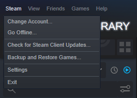

## We Haven't Met (GoldSrc)
Developer repository for upcoming game by [**StanleyLikesCyan**](https://www.youtube.com/c/StanleyLikesCyan).

## Meet The Developers!

| Name               | Role                                         |
| ------------------ | -------------------------------------------- |
| StanleyLikesCyan   | Lead Developer, Writer, Logo Designer, Music |
| Hylian Truthseeker | Voice Actor, Lead Artist, Level Designer     |
| Aperoacher         | Texture Designer                             |
| Triority           | TBD                                          |

# Play it for yourself!
1. Download or clone the repository

2. Copy the *wehaventmet* folder located inside the *whm_alpha[VERSION NUMBER]*

3. Paste it into *[YOUR STEAM DIRECTORY]* > steamapps > common > Half-Life

4. Restart Steam

5. The mod should be viewable within the Steam library

6. Press Play I guess

# What to expect?