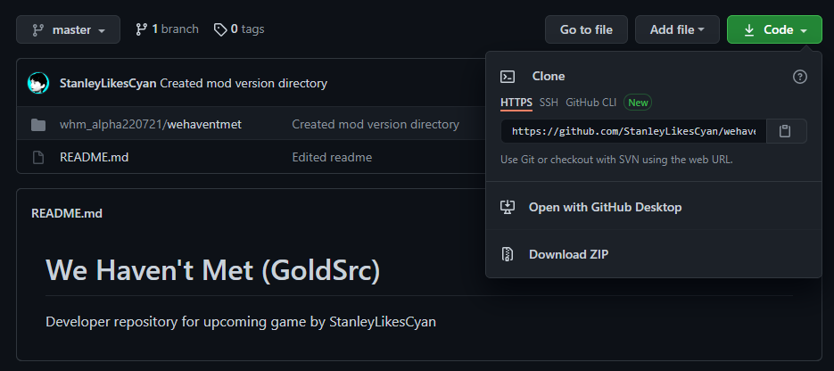
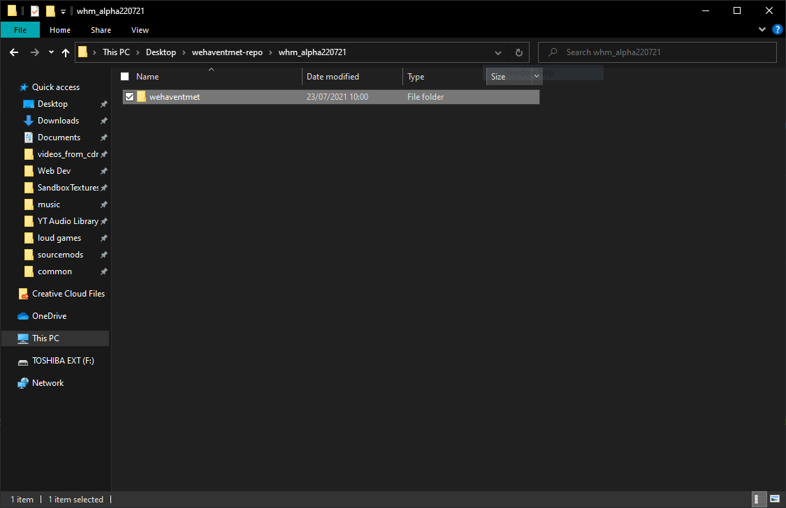
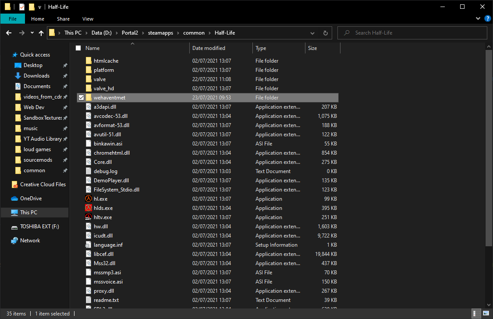
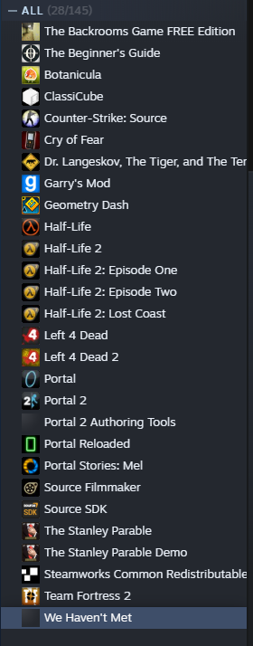
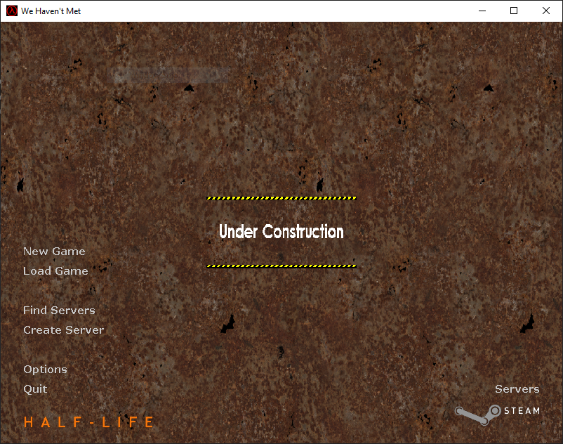
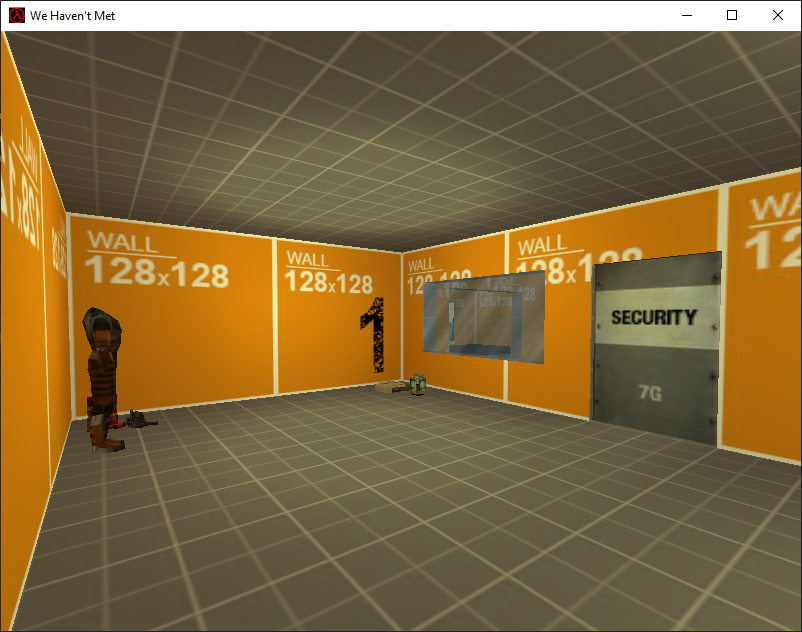
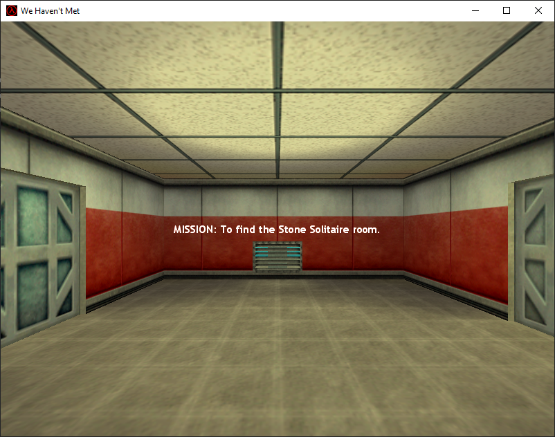

## We Haven't Met (GoldSrc)
Developer repository for upcoming game by [**StanleyLikesCyan**](https://www.youtube.com/c/StanleyLikesCyan).

## Meet The Developers!

| Name               | Role                                         |
| ------------------ | -------------------------------------------- |
| StanleyLikesCyan   | Lead Developer, Writer, Logo Designer, Music |
| Hylian Truthseeker | Voice Actor, Lead Artist, Level Designer     |
| Aperoacher         | Texture Designer                             |
| Triority           | TBD                                          |

# Play it for yourself!
1. Download or clone the repository

2. Copy the *wehaventmet* folder located inside the *whm_alpha[VERSION NUMBER]*

3. Paste it into *[YOUR STEAM DIRECTORY]* > steamapps > common > Half-Life

4. Restart Steam

5. The mod should be viewable within the Steam library

6. Press Play I guess

# What to expect?
Now obviously, the game isn't quite finished yet and is still a
Half-Life mod, there isn't much to expect right now. But here
is what you will expect as of writing.

When you first boot the mod, you'll see a typical Half-Life-esque
menu screen. The main difference being the background. If you click
on New Game, you'll get the default options of selecting either the
training room or in-game difficulty.

Upon entering the training room, you'll find yourself in a test
map made up of developer textures. This is to test out different
features available in Half-Life's engine, which will be particularly
useful later on when we start modifying GoldSrc's source code to
appeal to modern times.

Now for the actual game. Well, a placeholder before a draft
of the game will be ready to play. This is a joke map
all about how Gordon Freeman's goal is to play Stone Solitaire, 
which is a severely broken game available on Apple's App Store that
tries to mimic the classic game Peg Solitaire.

